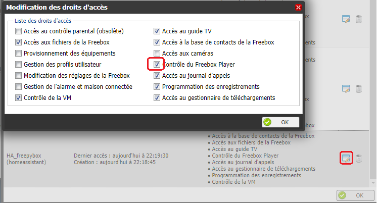
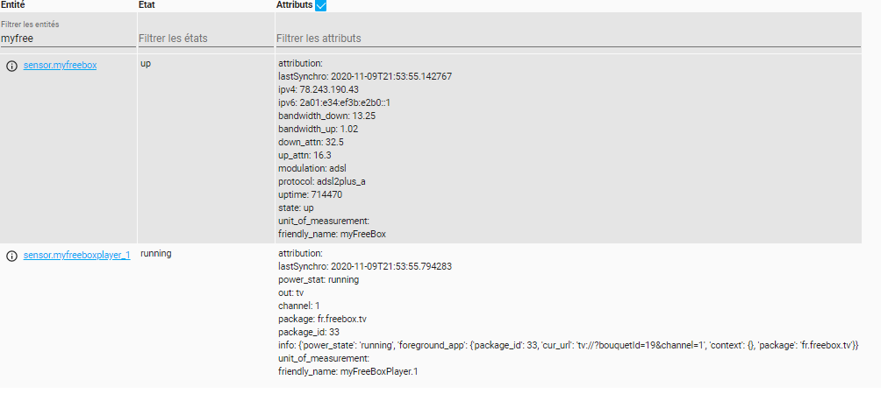

freebox for HA
==============

management simple de votre freebox et des freeplayer

vous pourrez ainsi savoir si votre freeplyer est allumé et sur quelle chaine.

exemple de configuration sensors.yaml

```
# freebox
- platform: apiFreebox
  host: mafreebox.freebox.fr
  scan_interval: 30
```

premiere demarrage : valider l'acces de l'application à votre freebox via la fleche droite sur le serveur

valider ensuite dans l'interface du serveur, l'acces au free player



redemarrer, vous aurez ensuite les informations sur la freebox et les freeplayer

